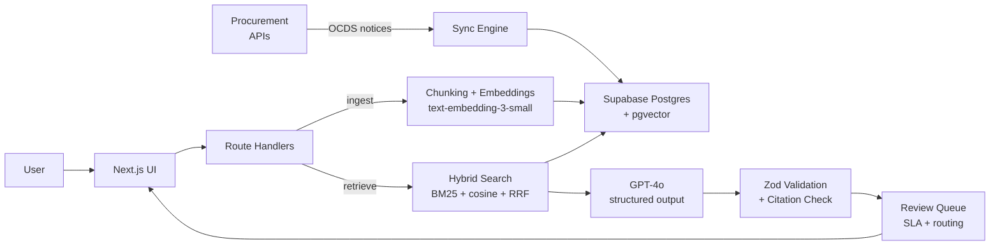

# AI Bid Manager

> Find, qualify, manage, and respond to UK public-sector tenders with AI — from opportunity discovery and bid/no-bid assessment through pipeline management, evidence-grounded drafting, review, and export.

Live demo: **[ai-rfp-agent-ten.vercel.app](https://ai-rfp-agent-ten.vercel.app)**  
Demo account: `demo@fortis-cyber.co.uk` / `FortisDemo2024!` (Fortis Cyber Solutions Ltd — a pre-built cyber security persona)

---

## What it does

The platform covers the full bid lifecycle for UK public-sector opportunities:

**Find** — Browse the Opportunities catalog (sourced from Find a Tender / Contracts Finder / NHS) or check AI-matched recommendations on My Opportunities. Save interesting tenders to your pipeline with one click.

**Qualify** — Run an AI fit analysis against your Organisation Profile (CPV codes, keywords, regions, certifications, contract value range). Get a fit score, reasons, risks, and a list of missing evidence to address.

**Extract** — On the RFP Response tab of any opportunity, click "Extract questions" next to an accessible tender document. The tool downloads the PDF, DOCX, or XLSX, runs text extraction, and uses GPT-4o to pull out every vendor requirement.

**Respond** — Click "Answer All" to generate structured draft responses for every question using your knowledge base. Each answer includes an executive summary, supporting evidence, source citations (server-verified), missing information flags, and a confidence level.

**Review** — Low-confidence or high-risk answers route to the Review Queue with SLA timers and topic-owner assignment. Approve, edit, and export to Word or generate a Compliance Matrix.

---

## How it works

```
Opportunity → extract questions from tender document
  → for each question:
      embed with text-embedding-3-small
      → hybrid search: pgvector cosine + full-text (BM25)
      → Reciprocal Rank Fusion → gpt-4o-mini rerank (14 → 6 chunks)
      → GPT-4o structured output (Zod-validated):
            draft answer · executive summary · citations
            confidence level · missing information · next actions
      → server-side citation verification
      → route low-confidence / high-risk to review queue
```

---

## Architecture



---

## Tech stack

| Layer               | Technology                                |
| ------------------- | ----------------------------------------- |
| Framework           | Next.js 16 (App Router) + TypeScript      |
| Database            | Supabase Postgres + pgvector              |
| Embeddings          | OpenAI text-embedding-3-small (1536 dims) |
| Generation          | OpenAI GPT-4o with structured output      |
| Auth                | Supabase Auth (magic link OTP)            |
| Email notifications | Resend                                    |
| Testing             | Vitest                                    |
| Deployment          | Vercel + Supabase Cloud                   |

---

## Features

### Intelligence

- **Opportunity catalog** — UK public-sector tenders from Find a Tender, Contracts Finder, and NHS sources, normalised to OCDS format
- **AI opportunity matching** — scored against your Organisation Profile (CPV codes, keywords, regions, contract value range, certifications)
- **Fit analysis** — per-opportunity fit score, readiness score, bid/no-bid recommendation, risks, and missing evidence gaps
- **Bid pipeline** — track opportunities through new-match → reviewing → bid → in-progress → awaiting-review → won/lost
- **Alerts** — saved searches with email notifications for new matching opportunities
- **Buyer intelligence** — browse buyers by region and sector

### Respond

- **Tender document extraction** — download a PDF, DOCX, or XLSX tender document and extract all vendor questions automatically using GPT-4o
- **Opportunity RFP Response tab** — per-opportunity question list with AI-powered draft answers, editable inline, with compliance matrix generation
- **Knowledge base** — upload any PDF, DOCX, XLSX, CSV, HTML, JSON, or Markdown file; documents are chunked and embedded for hybrid semantic search
- **Ask** — single-question RAG with streaming answers, confidence scores, and source citations
- **Hybrid search** — pgvector cosine similarity + Postgres full-text, merged with Reciprocal Rank Fusion, reranked by gpt-4o-mini
- **Structured generation** — GPT-4o with a Zod schema: draft answer, executive summary, evidence, citations, confidence, missing information, next actions
- **Server-verified citations** — cited chunk IDs are cross-checked against the retrieved set; hallucinated citations are stripped before reaching the UI
- **Review queue** — low-confidence and high-risk answers route to reviewers with email/Slack notification and SLA escalation
- **Word export** — export responses or full RFP batches to formatted `.docx`
- **Compliance matrices** — generate a requirement-by-requirement matrix from extracted questions, track status (not started → drafted → needs evidence → approved)
- **RFP Runs** — browse all past processing sessions from My Opportunities → RFP Runs tab
- **Query history** — every Ask answer stored and expandable

### Organisation

- **Organisation Profile** — set services, keywords, CPV codes, regions, certifications, accreditations, contract value range, and buyer preferences
- **Multi-org isolation** — each user gets a private org; all data (documents, queries, pipeline) is org-scoped
- **Admin routing** — per-topic owner, notification channel (email/Slack/both), escalation SLA; defaults to your own account when no rules are set

---

## Navigation

| Section      | Pages                                                                                                     |
| ------------ | --------------------------------------------------------------------------------------------------------- |
| Intelligence | Opportunities · My Opportunities (+ RFP Runs tab) · Bid Pipeline · Buyers · Alerts · Organisation Profile |
| Respond      | Dashboard · Ask · Knowledge Base · Review Queue · History                                                 |
| Bottom       | Admin · Help                                                                                              |

---

## Setup

### Prerequisites

- Node.js 20+
- A Supabase project (free tier is fine)
- An OpenAI API key
- A Resend account (for review notifications — optional)

### 1. Clone and install

```bash
git clone https://github.com/georget-j/ai-bid-manager.git
cd ai-bid-manager
npm install
```

### 2. Environment variables

```bash
cp .env.example .env.local
```

Fill in `.env.local`:

```
# Required
OPENAI_API_KEY=sk-...
NEXT_PUBLIC_SUPABASE_URL=https://your-project.supabase.co
NEXT_PUBLIC_SUPABASE_ANON_KEY=eyJ...
SUPABASE_SERVICE_ROLE_KEY=eyJ...

# Recommended
NEXT_PUBLIC_APP_URL=https://your-app.vercel.app   # used for CSRF check
RESEND_API_KEY=re_...                              # review queue notifications

# Production only
CRON_SECRET=<random string>                        # secures the escalation cron job
```

### 3. Database setup

Run migrations in order from `supabase/migrations/` in your Supabase SQL editor:

```
001–010  core schema (vector, tables, hybrid search, rate limits, review workflow)
011      Row Level Security policies
012      Orgs + org_memberships
013      Answer library
014      RFP run questions (checkpoint/resume)
015      Fix conflicting RLS policies
016      Org-scoped retrieval (hybrid_search_chunks)
017      Procurement tables (opportunities, buyers, sources, profiles, pipeline)
018      RFP → opportunity link
019      Compliance matrix
020      Alert rules
021      Tighten RLS (org-scope remaining tables)
022+     Additional procurement and feature tables
```

Or push all at once with the Supabase CLI:

```bash
supabase db push
```

### 4. Run locally

```bash
npm run dev
```

Open [http://localhost:3000](http://localhost:3000).

### 5. Try the demo account

Log in at `/login` with `demo@fortis-cyber.co.uk` / `FortisDemo2024!` to explore the system with a pre-populated knowledge base for a fictional UK cyber security consultancy (Fortis Cyber Solutions Ltd). The KB contains 13 documents covering company overview, case studies, certifications, service catalogue, team profiles, methodology, and more.

---

## Environment variables

| Variable                        | Required    | Description                                    |
| ------------------------------- | ----------- | ---------------------------------------------- |
| `OPENAI_API_KEY`                | Yes         | OpenAI API key — server-side only              |
| `NEXT_PUBLIC_SUPABASE_URL`      | Yes         | Supabase project URL                           |
| `NEXT_PUBLIC_SUPABASE_ANON_KEY` | Yes         | Supabase anon/public key                       |
| `SUPABASE_SERVICE_ROLE_KEY`     | Yes         | Supabase service role key — server-side only   |
| `NEXT_PUBLIC_APP_URL`           | Recommended | App URL for CSRF origin check                  |
| `RESEND_API_KEY`                | Optional    | Resend key for review email notifications      |
| `DEMO_MODE`                     | Dev only    | `true` bypasses auth — never set in production |
| `CRON_SECRET`                   | Production  | Secret for the `/api/cron/escalate` endpoint   |

---

## Tests

```bash
npm test
```

Unit tests across chunking, prompt construction, schema validation, and extraction logic.

---

## How chunking works

Documents are split on `##` and `###` headings. Each section becomes a chunk prefixed with `[Document Title > Section Name]`. This keeps semantically related content together, gives the embedding model a clear topic signal, and makes citations navigable — when the system says it found something in "Capability Statement › Certifications", you can go directly to that section.

For plain text without headers, it falls back to paragraph/sentence boundary splitting with 150-character overlap.

---

## Deploying

The project is configured for Vercel + Supabase:

1. Push to GitHub
2. Import to Vercel — Next.js is auto-detected
3. Add environment variables in Vercel project settings
4. Run SQL migrations in your Supabase SQL editor (or `supabase db push`)
5. Set `DEMO_MODE=false` (or leave unset) in production

The `vercel.json` configures a cron job that runs hourly to escalate overdue review items. Add `CRON_SECRET` to your Vercel env vars to secure it.

---

## Security

- Row Level Security is enabled on all tables; all data access is additionally filtered by `org_id` at the application layer
- Multi-tenant: each user provisioned with a private org on first login; no cross-org data access
- Export routes require authentication
- `DEMO_MODE=true` is blocked in `NODE_ENV=production`
- Service role key is server-side only; anon key has no write access to sensitive tables

---

## What it won't do

- Invent facts, metrics, customer names, or certifications not in your documents
- Make bid/no-bid decisions for you — outputs are drafts for human review
- Replace a subject-matter expert — it pulls together what you have

---

_George Terpitsas · [github.com/georget-j](https://github.com/georget-j) · georgeterpitsas1@hotmail.co.uk_
