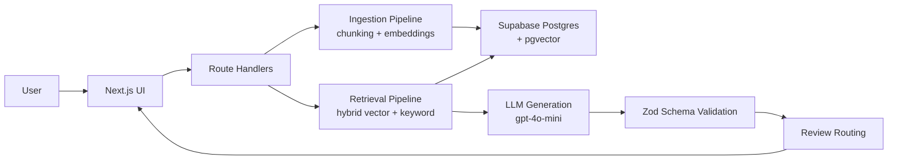

# AI RFP Agent

> Draft RFP responses grounded in your internal knowledge base — with source citations, confidence scoring, missing information flags, and a human-in-the-loop review queue.

---

## Why I built this

Answering RFPs and proposal questions is one of the most time-consuming things a B2B team does. The knowledge you need already exists somewhere — a case study, a security note, an implementation playbook — but pulling it together under deadline pressure is painful. Generic AI tools make it worse because they invent answers, and in enterprise sales that gets you into trouble fast.

This project is my attempt to build what that workflow should actually look like: a structured retrieval and generation pipeline where every claim is grounded in a source document and every gap is flagged explicitly, so the output is a strong, reviewable first draft — one you refine into a proposal rather than copy-paste, with the AI's uncertainty surfaced instead of hidden.

---

## What it does

You load your knowledge base (case studies, security docs, implementation guides, answer libraries). You ask a question or upload an RFP. It finds the most relevant content, generates a structured response in enterprise proposal style, and shows you exactly where every claim came from.

```
Your question / RFP batch
  → embed with text-embedding-3-small
  → hybrid search: cosine similarity + full-text (pgvector)
  → top chunks retrieved
  → gpt-4o-mini generates structured response (Zod-validated JSON)
  → response includes:
      draft answer · executive summary · supporting evidence
      source citations (server-verified) · missing info flags
      confidence level · next actions
  → low-confidence / high-risk answers routed to review queue
```

---

## Architecture



---

## Tech stack

| Layer               | Technology                                |
| ------------------- | ----------------------------------------- |
| Framework           | Next.js 16 (App Router) + TypeScript      |
| Styling             | Tailwind CSS v4                           |
| Database            | Supabase Postgres + pgvector              |
| Embeddings          | OpenAI text-embedding-3-small (1536 dims) |
| Generation          | OpenAI gpt-4o-mini with structured output |
| Email notifications | Resend                                    |
| Testing             | Vitest                                    |
| Deployment          | Vercel + Supabase Cloud                   |

---

## Features

- **Multi-format ingestion** — PDF, DOCX, XLSX, CSV, Markdown, JSON, HTML, and plain text
- **Markdown-aware chunking** — documents split on `##` section boundaries, each chunk prefixed with `[Document > Section]` for better embedding quality and cleaner citations
- **Hybrid search** — pgvector cosine similarity combined with full-text keyword search for better recall on exact-match queries
- **Batch RFP processing** — upload an RFP, extract questions, process up to 100 in parallel with SSE streaming progress
- **Structured generation** — gpt-4o-mini with a Zod schema as the response format, so the type flows from the database straight to the UI with no manual parsing
- **Source citations (server-verified)** — every key claim links to the source document, chunk content, and similarity score; citations are verified server-side against retrieved chunk IDs
- **Missing information flags** — explicit acknowledgement of what isn't covered, with a suggested owner for each gap
- **Confidence levels** — high/medium/low with a plain-English reason, grounded in how well the retrieved content actually answers the question
- **Human-in-the-loop review queue** — low-confidence and high-risk answers are automatically routed to the right reviewer with email/Slack notification and SLA escalation
- **Word export** — export single responses or full RFP batches to a formatted `.docx` file
- **Run history** — browse past RFP runs and individual question results
- **One-click sample dataset** — 8 realistic enterprise documents loaded with a single button

---

## What it won't do

- Invent facts, metrics, customer names, or certifications that aren't in your documents
- Make decisions for you — outputs are drafts for human review
- Replace a subject-matter expert — it pulls together what you have, it doesn't know what you don't

---

## Setup

### Prerequisites

- Node.js 20+
- A Supabase project (free tier is fine)
- An OpenAI API key
- A Resend account (for review notifications — optional)

### 1. Clone and install

```bash
git clone https://github.com/georget-j/ai-rfp-agent.git
cd ai-rfp-agent
npm install
```

### 2. Environment variables

```bash
cp .env.example .env.local
```

Fill in `.env.local`:

```
# Required
OPENAI_API_KEY=sk-...
NEXT_PUBLIC_SUPABASE_URL=https://your-project.supabase.co
NEXT_PUBLIC_SUPABASE_ANON_KEY=eyJ...
SUPABASE_SERVICE_ROLE_KEY=eyJ...

# Recommended
NEXT_PUBLIC_APP_URL=https://your-app.vercel.app   # used for CSRF check
RESEND_API_KEY=re_...                              # review queue notifications

# Production only
CRON_SECRET=<random string>                        # secures the escalation cron job
```

### 3. Database setup

Run the migration files in your Supabase project's SQL editor in order:

1. `001_enable_vector.sql` — pgvector extension
2. `002_create_tables.sql` — documents, chunks, queries, results
3. `003_match_function.sql` — vector similarity function
4. `004_hybrid_search.sql` — hybrid search function
5. `005_fix_hybrid_search.sql` — hybrid search fix
6. `006_extended_metadata.sql` — document metadata columns
7. `007_rate_limits.sql` — rate limiting table and function
8. `008_review_workflow.sql` — review queue, routing config, approved answers
9. `009_review_enhancements.sql` — escalation columns, comments, audit log
10. `010_engineering_topic.sql` — engineering routing topic
11. `011_rls.sql` — Row Level Security policies

### 4. Run locally

```bash
npm run dev
```

Open [http://localhost:3000](http://localhost:3000).

### 5. Load sample data

Click **"Load Sample Documents"** on the dashboard. It ingests 8 sample enterprise documents, chunks them, generates embeddings, and stores everything in Supabase.

> This makes roughly 8 batched embedding API calls — total cost is under $0.01.

---

## Environment variables

| Variable                        | Required      | Description                                    |
| ------------------------------- | ------------- | ---------------------------------------------- |
| `OPENAI_API_KEY`                | Yes           | OpenAI API key — server-side only              |
| `NEXT_PUBLIC_SUPABASE_URL`      | Yes           | Supabase project URL                           |
| `NEXT_PUBLIC_SUPABASE_ANON_KEY` | Yes           | Supabase anon/public key                       |
| `SUPABASE_SERVICE_ROLE_KEY`     | Yes           | Supabase service role key — server-side only   |
| `NEXT_PUBLIC_APP_URL`           | Recommended   | App URL for CSRF origin check                  |
| `RESEND_API_KEY`                | Optional      | Resend key for review email notifications      |
| `DEMO_MODE`                     | Dev/demo only | `true` bypasses auth (never set in production) |
| `CRON_SECRET`                   | Production    | Secret for the `/api/cron/escalate` endpoint   |

---

## Example questions to try

After loading the sample documents:

1. _"Draft a response to a fintech customer asking how we reduce AML review time."_
2. _"Do we have SOC 2 certification? What's our current compliance status?"_
3. _"Which case studies are relevant to a legaltech workflow automation pitch?"_
4. _"What does our standard implementation timeline look like, and what do we need from the customer?"_
5. _"Can this platform help with hospital staffing optimisation?"_ — off-topic test, should return low confidence with no invented healthcare capabilities

---

## Tests

```bash
npm test
```

Unit tests across chunking, prompt construction, and schema validation.

---

## How chunking works

Documents are split on `##` and `###` headings. Each section becomes a chunk (or several if it's long), prefixed with `[Document Title > Section Name]`. This keeps semantically related content together and gives the embedding model a clear topic signal rather than arbitrary character slices.

For plain text documents without headers, it falls back to paragraph/sentence boundary splitting with 150-character overlap.

The `[Title > Section]` prefix also shows up in citations, so when the LLM says it found something in "Implementation Playbook > Discovery Phase", you can go find that section directly.

---

## Evaluation

See [/docs/evaluation.md](./docs/evaluation.md) for test cases, expected retrieval behaviour, pass/fail criteria, known failure modes, and suggested improvements.

---

## Deploying

The project is set up for Vercel + Supabase:

1. Push to GitHub
2. Import to Vercel — Next.js is auto-detected
3. Add environment variables in Vercel project settings (see table above)
4. Run the SQL migrations in your Supabase SQL editor
5. Set `DEMO_MODE=false` (or leave unset) in production

The `vercel.json` in this repo configures a cron job that runs hourly to escalate overdue review items. Add `CRON_SECRET` to your Vercel environment variables to secure it.

---

## What this demonstrates

A complete RAG pipeline in TypeScript: document ingestion → multi-format extraction → markdown-aware chunking → batch embeddings → hybrid pgvector search → structured gpt-4o-mini generation → Zod-validated typed response → server-verified citations → human-in-the-loop review routing.

Design choices worth noting:

- **Zod as the OpenAI response format** — one source of truth, types flow all the way through from database to UI
- **SQL-native vector search** via pgvector rather than a separate vector database — simpler ops, joins work normally, no sync issues
- **Hybrid search** — pgvector cosine similarity plus Postgres full-text, giving better recall on exact-match terms
- **Explicit missing information** in the response schema — the model is forced to surface gaps rather than paper over them
- **Section-aware chunking** — keeps the embedding meaningful and makes citations navigable
- **Server-verified citations** — chunk IDs are cross-checked server-side; hallucinated citations are stripped before the response reaches the UI

---

## Security note

Documents are stored as plain text in Supabase. Row Level Security is enabled on all tables (`011_rls.sql`). For multi-user deployments, configure Supabase Auth and tighten RLS policies to org scope before going live.

Never set `DEMO_MODE=true` in production — this flag bypasses auth enforcement and is only safe in local development or isolated demo environments.

---

_George Terpitsas — [github.com/georget-j](https://github.com/georget-j) — georgeterpitsas1@hotmail.co.uk_
